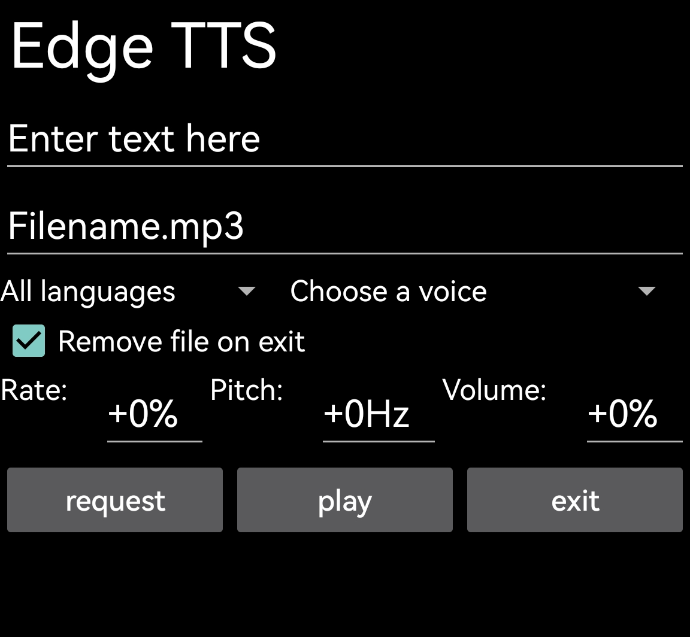

An [edge-tts](https://github.com/rany2/edge-tts) frontend on Android using [Termux:GUI Python bindings](https://github.com/tareksander/termux-gui-python-bindings).

## Install and usage

Install [Termux:GUI](https://github.com/termux/termux-gui) and dependencies:
```sh
pkg install python mpv
pip install edge-tts termuxgui
```

Then run `python tts.py` on your Termux session.

GUI usage:
1. Enter the text you want to transform into speech and a file name
2. Set a voice (use the spinbox on the left to filter voices with certain language)
3. Press `request` to send a TTS request and download it as an mp3 audio file
4. Press `play` to play the downloaded audio
5. Uncheck the checkbox if you want to keep the downloaded file

## Screenshot



## License

Apache License 2.0
